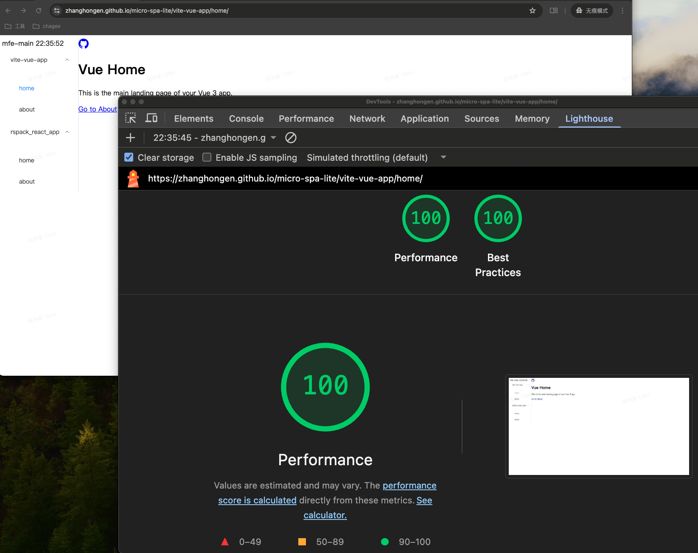

# Micro‑SPA‑Lite 🚀

Ultra‑lightweight micro‑frontend boilerplate (~100 LOC) with single‑spa, Module Federation & Chrome extension support

Start building blazing‑fast micro‑frontends in minutes – no boilerplate bloat, full performance toolkit.

Example using a Vite Vue app and a Rspack React app as two micro frontend sub-applications

```
pnpm install && pnpm run dev
```




## 🚀 Features

-	**Minimal Design**: Core logic written in fewer than 100 lines of JavaScript, enabling micro-frontend app loading, mounting, and unmounting (mfe-main)
-	**Lightweight Dependencies**: No additional runtime frameworks; relies only on single-spa and Module Federation
-	**High-Performance Loading**: Uses manifest + runtimePlugins to enable parallel loading of main and sub-apps on first screen, eliminating waterfall loading
-	**Flexible Development Mode**: Supports local development of any sub-app via Chrome extension proxy without modifying the main app

---

## 🌐 Online Demo Experience

🔗 **Host Demo**: Click here to see the live demo -> [Live Demo](https://zhanghongen.github.io/micro-spa-lite/vite-vue-app/home/) 
- Demonstrates on-demand loading of Vite Vue and Rspack React apps, with dynamic switching in the UI
- Chrome extension example showcases non-intrusive injection of sub-modules into any page

---

## 🧩 Single Module Development Guide

If you only want to start a single sub-module for development and debugging, you can follow these steps:
1. git clone https://github.com/zhangHongEn/micro-spa-lite.git
2. `pnpm install && pnpm run dev`
3. open chrome plugin `module-federation`
4. vite-vue-app proxy to `http://localhost:5001/mf-manifest.json`
5. rspack-react-app proxy to `http://localhost:5002/mf-manifest.json`
